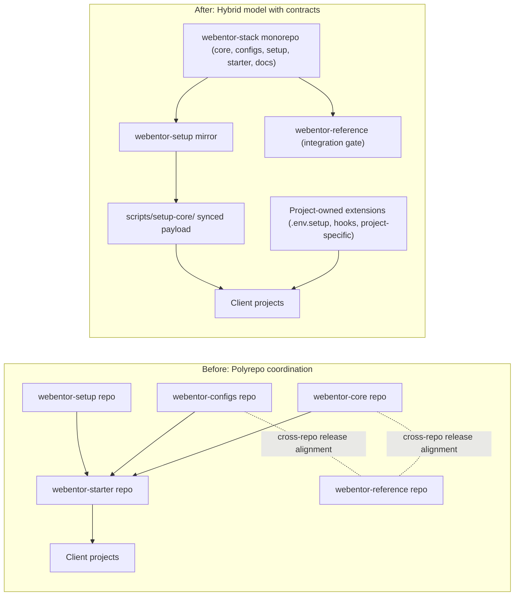

# Webentor Stack Restructuring Case Study

## Executive Summary

Webentor moved from a polyrepo setup to a hybrid operating model: one `webentor-stack` monorepo for shared platform packages, a separate `webentor-reference` repository as an integration gate, and a dedicated `webentor-setup` mirror for subtree-based distribution.
This was not only a repository migration. It was a shift in how the team owns setup, upgrades, onboarding, and releases across projects.

The result was a simpler developer path, faster shared delivery, and a clearer contract between reusable runtime code and project-specific customization.

## Where We Started

Before restructuring, shared logic was spread across multiple repositories and copied in different forms across projects. The system worked, but it created predictable friction:

- Similar setup and linting logic had to be maintained in more than one place.
- Shared changes often required cross-repo coordination and multiple pull requests.
- New projects and onboarding paths were not fully consistent.
- Documentation reflected older polyrepo assumptions and occasionally contradicted runtime reality.

In short, the platform had grown, but the operating model had not kept up.

## The Core Problem (In Human Terms)

### 1) Every Project Felt Slightly Different

Teams could start quickly, but projects drifted over time. Shared setup behavior and project-owned custom logic were not always clearly separated. That increased maintenance cost and made upgrades harder to trust.

### 2) Shipping Shared Changes Was Slower Than It Should Be

Cross-cutting updates often involved touching multiple repositories and coordinating release timing. Even when the code changes were small, delivery overhead was not.

### 3) Onboarding Took Too Much Translation

Developers had to mentally map docs, scripts, and repository boundaries before they could make confident changes. The first run experience was not as predictable as it needed to be.

## What We Considered

We evaluated three options:

1. Keep polyrepo and standardize scripts incrementally.
2. Move everything, including the integration app, into one monorepo.
3. Adopt a hybrid model: monorepo for shared packages, separate reference app.

Option 1 reduced disruption but did not solve coordination overhead enough.
Option 2 improved centralization but weakened the role of an independent integration gate.
Option 3 gave us the best balance: fast shared development, plus an external safety net for release validation.

## Decision: Hybrid Model with Explicit Contracts

We chose a hybrid architecture built around clear ownership boundaries:

- `webentor-stack` is the source of truth for shared packages and docs:
  - `webentor-core`
  - `webentor-configs`
  - `webentor-setup`
  - `webentor-starter`
  - docs
- `webentor-reference` remains external and acts as an integration gate.
- `webentor-setup` is mirrored to support subtree-based consumption in client projects.

This model was designed around real distribution constraints, not theoretical purity.

## What Changed in Practice

### Shared Runtime Became a Stable Setup Contract

`webentor-setup` now defines how setup and upgrades should behave across projects. Runtime scripts are consumed into `scripts/setup-core/` as synchronized payload, while project-specific behavior stays outside shared runtime.

Project extensions are intentionally limited to:

- `scripts/.env.setup`
- `scripts/hooks/`
- `scripts/project-specific/`

This boundary prevents project logic from leaking into core runtime and makes upgrades safer.

### Upgrade Safety Became a First-Class Workflow

Starter upgrades use versioned manifests, dry-run reporting, and protected project-owned paths. Teams can inspect planned changes before applying them, which reduces migration risk and improves confidence.

### Documentation Was Treated as Operating Model, Not Afterthought

The onboarding path was consolidated, navigation was simplified, and outdated assumptions were removed. The objective was simple: reduce interpretation work for developers and make the canonical flow obvious.

## Rollout Strategy

The migration was executed in phases to minimize disruption:

1. Freeze and baseline current repositories.
2. Import shared repositories into monorepo package boundaries.
3. Keep `webentor-reference` separate and wire CI integration checks.
4. Shift setup consumption toward package-driven runtime contract.
5. Migrate existing projects in controlled batches using a runbook.
6. Use rollback checkpoints and dry-run-first rules throughout rollout.

This gave the team a reversible path at every major step.

## Before and After Architecture

## One Migration Example (Old Project to New Contract)

A typical migration now follows a consistent path:

1. Sync `scripts/setup-core/` from `webentor-setup` mirror.
2. Run `upgrade-starter` in dry-run mode and review the report.
3. Move any project-specific setup logic out of `setup-core` and into hooks or project-specific scripts.
4. Apply approved changes and run project checks.

The key behavior change is predictability: teams review planned transforms before modifying project state.

## Outcomes

### Operational Improvements

- Cross-package platform changes are delivered through a single coordinated workflow.
- New developers have one canonical setup path and fewer decision points.
- Upgrade work is more deterministic because migration behavior is explicit.
- Ownership boundaries are clearer, which lowers accidental coupling.

### Risk Management Improvements

- CI scope is easier to reason about with package boundaries.
- Setup distribution remains compatible with subtree consumers.
- Batch rollout and rollback checkpoints reduce blast radius.
- Hook-based extension points preserve flexibility without weakening shared runtime.

## Metrics to Track (Before vs After)

<!-- Maintainer note: keep these placeholders until at least one full quarter of post-migration data is available. -->
<!-- Maintainer note: prefer values from CI analytics and onboarding logs over anecdotal estimates. -->

- New developer setup time: `<before>` -> `<after>`
- Cross-repo PR count per shared feature: `<before>` -> `<after>`
- Lead time for shared release: `<before>` -> `<after>`
- Setup failure rate on fresh clone: `<before>` -> `<after>`
- Migration duration per project: `<before>` -> `<after>`

## Lessons Learned

1. Distribution constraints (like subtree sync) should inform architecture decisions early.
2. An external integration gate is critical for safe shared releases.
3. Migration speed improves when runbooks and checkpoints are explicit.
4. Standardizing setup and tooling creates disproportionate long-term payoff.
5. Enforcing project/runtime boundaries is as important as code quality itself.

## What Is Next

1. Complete remaining legacy project migrations in batches.
2. Measure outcomes quarterly to validate long-term ROI.
3. Expand upgrade automation and dry-run diagnostics.
4. Continue improving docs discoverability for common onboarding and migration paths.
