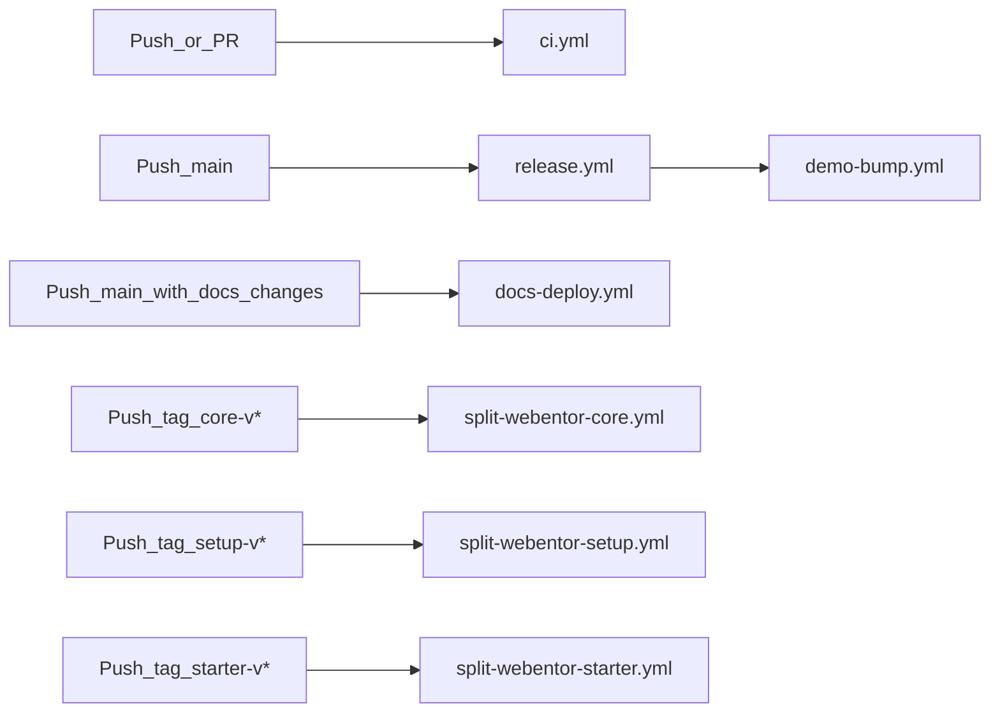

# Monorepo Developer Workflow

This playbook reflects the current `webentor-stack` monorepo workflow.

## How the stack is organized

Work inside one repository with package boundaries:

1. `packages/webentor-core` - shared PHP + JS runtime (blocks, images, filters, frontend/editor logic).
2. `packages/webentor-configs` - shared lint/format presets.
3. `packages/webentor-setup` - shared setup runtime + setup CLI contract.
4. `packages/webentor-starter` - starter template composition.
5. `docs` - VitePress documentation.

External context:

- `webentor-demo` remains an external integration target used for final validation.

## Daily workflow (where to make changes)

Use change scope to choose location:

1. Shared runtime behavior -> `packages/webentor-core`.
2. Shared lint/format rules -> `packages/webentor-configs`.
3. Setup/bootstrap/upgrade behavior -> `packages/webentor-setup`.
4. Starter defaults and wrapper integration -> `packages/webentor-starter`.
5. Documentation and rollout notes -> `docs`.

Rule of thumb: if multiple projects should reuse it, implement it in shared packages, not in project-specific hooks.

## Validation workflow

For package-level changes:

1. Run package-local checks in the changed package.
2. Validate docs/contracts affected by that change.
3. Validate integrated behavior through starter/demo flow before release.

Typical checks:

- Setup/runtime syntax checks in `webentor-setup`.
- PHP syntax checks for setup CLI and touched PHP files.
- Docs build for documentation changes.

## What happens after push (CI pipeline)

Repository automation is split by trigger type so CI stays fast and release steps remain auditable.

- `.github/workflows/ci.yml`:
  - Runs on every pull request and every push to `main`.
  - Uses `dorny/paths-filter` to execute only jobs for changed areas.
  - `core` and `configs` jobs run lint/build/test.
  - `setup` job validates shell scripts and setup CLI PHP syntax.
  - `starter` job installs composer dependencies and builds the theme.
  - `docs` job builds VitePress docs.
- `.github/workflows/docs-deploy.yml`:
  - Runs on push to `main` when `docs/**` changed.
  - Builds docs and deploys to GitHub Pages.
- `.github/workflows/release.yml`:
  - Runs on push to `main`.
  - Uses Changesets action to open/update the "Version Packages" PR.
  - After merging that PR, publishes `webentor-core` and `webentor-configs` to npm.
- `.github/workflows/demo-bump.yml`:
  - Runs after `release.yml` completes successfully.
  - Invokes `scripts/bump-demo.sh` to trigger downstream demo integration bump flow (placeholder implementation).
- `.github/workflows/split-webentor-core.yml`, `.github/workflows/split-webentor-setup.yml`, and `.github/workflows/split-webentor-starter.yml`:
  - Run on namespaced monorepo tags (`core-v*`, `setup-v*`, `starter-v*`) or manual dispatch.
  - Use subtree split scripts to mirror package contents to standalone repositories.
  - Mirror repositories receive normalized semver tags (`vX.Y.Z`) for downstream package tooling compatibility.

## How to change and release a package

Use this sequence for package changes so CI, releases, and downstream integration stay synchronized:

1. Create a feature branch and implement changes in the relevant `packages/*` directory.
2. Add a changeset:
   1. Run `pnpm changeset`.
   2. Select affected package(s).
   3. Select semver bump type.
   4. Write a short release summary.
3. Open a pull request; `ci.yml` validates changed areas.
4. Merge the PR into `main`; `release.yml` then opens/updates the "Version Packages" PR.
5. Merge the version PR; Changesets bumps versions/changelogs and publishes npm packages.
6. Confirm `demo-bump.yml` ran successfully after release.
7. Push a namespaced tag when you want to trigger a specific split mirror:
   1. `core-v*` -> `split-webentor-core.yml`
   2. `setup-v*` -> `split-webentor-setup.yml`
   3. `starter-v*` -> `split-webentor-starter.yml`
   4. Mirror scripts normalize these to `vX.Y.Z` tags in target repositories.

## Release and rollout order

When changes span multiple packages, keep this order and map each stage to automation:

1. `webentor-core` and/or `webentor-configs`
   - Add changesets in PRs.
   - `release.yml` + Changesets handles version PR and npm publish after merge.
2. `webentor-setup` (include upgrade recipe when behavior changes)
   - Validate runtime/CLI contract updates.
   - Trigger split mirror via `setup-v*` tag when ready.
3. `webentor-starter`
   - Validate integrated behavior against updated package outputs.
   - Trigger split mirror via `starter-v*` tag when ready.
4. `webentor-core` mirror (for standalone Composer delivery)
   - Trigger split mirror via `core-v*` tag when ready.
   - Confirm target mirror tag is normalized to `vX.Y.Z`.
5. `webentor-demo` integration validation and bump
   - Validate downstream compatibility after release.
   - `demo-bump.yml` is the automation hook for this handoff.

## Setup-core contract (do not break)

In consumer projects:

- `scripts/setup-core/` is synchronized runtime payload from `webentor-setup`.
- Do not put project business logic in `setup-core`.

Project-specific setup customization belongs in:

- `scripts/.env.setup`
- `scripts/hooks/`
- `scripts/project-specific/`

## Team working agreement

1. Keep reusable behavior in shared packages, not in ad-hoc project patches.
2. Keep setup contract updates synchronized across runtime scripts, CLI behavior, docs, and upgrade manifests.
3. Treat demo integration checks as release gate before declaring coordinated changes complete.
