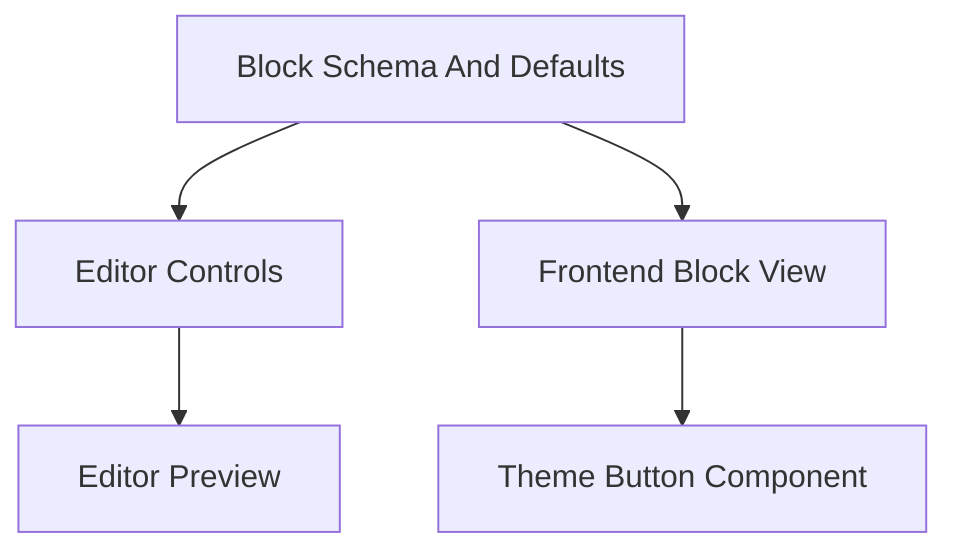

# Extend `e-button`

Use this guide when you need to add a new property to `webentor/e-button` and want
it to behave consistently in Gutenberg and on the frontend.

The important mental model is that a button extension is usually not one change.
It is a small pipeline that crosses editor state, editor UI, editor preview, and
frontend rendering.

## How to think about it

An `e-button` extension usually has four layers:

- Attribute schema and defaults: the block needs to know the property exists so
  Gutenberg can persist it reliably.
- Editor controls: the `WebentorButton` popover needs a control that lets users
  edit the property.
- Editor preview: if the property affects appearance, the preview button in the
  editor should reflect it.
- Frontend render: the block Blade view needs to forward the property into
  `<x-button>`, where frontend class and markup decisions are made.

If you only change one layer, the feature usually feels broken somewhere else.

## End-to-end flow



## Recommended file split

Keep editor-specific button extensions in a dedicated filter module and import it
from your theme editor entry.

- Example editor entry: `resources/scripts/editor.ts`
- Example extension module: `resources/scripts/blocks-filters/_button-extension.tsx`
- Frontend override: `resources/blocks/e-button/view.blade.php`

The starter theme already uses `resources/scripts/editor.ts` as the editor entry
point, so adding a dedicated button extension module keeps button-specific logic
out of broader setup code.

## 1. Extend stored data

`webentor/e-button` stores its data inside the `button` attribute object. The core
block default lives in `packages/webentor-core/resources/blocks/e-button/block.json`.

When you add a nested property such as `asPill`, extend the `button.default`
object during block registration in the editor:

```tsx
addFilter(
  'blocks.registerBlockType',
  'theme/button-attribute-extension',
  (settings, name) => {
    if (name !== 'webentor/e-button') {
      return settings;
    }

    return {
      ...settings,
      attributes: {
        ...settings.attributes,
        button: {
          ...settings.attributes?.button,
          default: {
            ...settings.attributes?.button?.default,
            asPill: settings.attributes?.button?.default?.asPill ?? false,
          },
        },
      },
    };
  },
);
```

Use this pattern when you are extending the existing nested `button` object in the
editor.

If you also need to change PHP-side registration defaults before the block is
registered, use `webentor/block_type_metadata_settings` from the
[PHP API reference](../reference/php-api.md).

## 2. Add editor controls

`WebentorButton` exposes `webentor.core.button.extensionComponent` for injecting
extra controls into the existing button popover.

That is the right extension point for adding project-specific controls without
forking the whole button UI.

```tsx
addFilter(
  'webentor.core.button.extensionComponent',
  'theme/button-extension-component',
  (extensionComponent, props) => {
    const buttonAttributes = props.attributes?.button ?? {};

    return (
      <>
        {extensionComponent}
        <ToggleControl
          label={__('Is Pill?', 'webentor')}
          checked={buttonAttributes.asPill ?? false}
          onChange={(value) =>
            props.setAttributes?.({
              button: {
                ...buttonAttributes,
                asPill: value,
              },
            })
          }
        />
      </>
    );
  },
);
```

If your project uses `WebentorButton` in more than one context, add a scope guard
before injecting controls so the extension only affects the intended consumer.

## 3. Update the Gutenberg preview

`webentor.core.button.extensionComponent` only changes the editor UI. It does not
change the preview markup by itself.

If the new property changes appearance, extend the preview with
`webentor.core.button.output`.

Prefer modifying the existing preview output instead of reimplementing the entire
button. In practice, cloning the existing element and appending a class is usually
the safest approach.

```tsx
addFilter(
  'webentor.core.button.output',
  'theme/button-output-extension',
  (output, props) => {
    if (!props.attributes?.button?.asPill || !isValidElement(output)) {
      return output;
    }

    const existingClassName = output.props.className ?? '';

    if (existingClassName.includes('btn--pill')) {
      return output;
    }

    return cloneElement(output, {
      className: `${existingClassName} btn--pill`.trim(),
    });
  },
);
```

This hook is editor-only. It improves Gutenberg feedback, but it does not affect
the rendered frontend HTML.

## 4. Bridge the property to frontend rendering

Frontend rendering happens through the block Blade view, not through
`webentor.core.button.output`.

Core maps `webentor/e-button` attributes into `<x-button>` in
`packages/webentor-core/resources/blocks/e-button/view.blade.php`. To add a new
button property on the site, override the block view in your theme and forward the
new prop into `<x-button>`.

Valid override locations are:

- `resources/blocks/e-button/view.blade.php`
- `resources/views/blocks/e-button/view.blade.php`

The starter theme resolves theme view paths before core paths in
`config/view.php`, which is why a theme-local block view override works.

Example:

```blade
<x-button
  url="{{ $attributes['button']['url'] ?? '' }}"
  title="{!! $attributes['button']['title'] ?? '' !!}"
  openInNewTab="{{ $attributes['button']['newTab'] ?? false }}"
  variant="{{ $attributes['button']['variant'] ?? '' }}"
  size="{{ $attributes['button']['size'] ?? '' }}"
  classes="{{ $block_classes ?? '' }}"
  icon="{{ !empty($attributes['button']['showIcon']) && !empty($attributes['button']['icon']['name']) ? $attributes['button']['icon']['name'] : '' }}"
  iconPosition="{{ $attributes['button']['iconPosition'] ?? '' }}"
  element="{{ $attributes['button']['htmlElement'] ?? 'a' }}"
  asPill="{{ $attributes['button']['asPill'] ?? false }}"
/>
```

There is also a `render_blade_block_webentor/e-button` PHP filter for post-processing
HTML, but that is usually a worse fit for adding new button properties than
overriding the block view and forwarding the prop explicitly.

## 5. Keep frontend class logic in the button component

The reusable frontend source of truth should stay in the theme button component,
for example `app/View/Components/Button.php`.

That component is where class composition should happen:

- variant classes
- size classes
- icon-related classes
- any new classes such as `btn--pill`

Keep the block view thin. Its job is to forward block data into `<x-button>`, not
to duplicate class-building logic inline in Blade.

## Rule of thumb

If the property is:

- stored data: extend block attributes/defaults
- editable in admin: use `webentor.core.button.extensionComponent`
- visible in Gutenberg preview: use `webentor.core.button.output`
- needed on the site: pass it through the block `view.blade.php`
- affecting reusable frontend classes or markup: handle it in `Button.php`

## Related docs

- [Editor Components](./editor-components.md)
- [Core Frontend Components](./core-frontend-components.md)
- [JS / TypeScript API](../reference/js-api.md)
- [PHP API](../reference/php-api.md)
