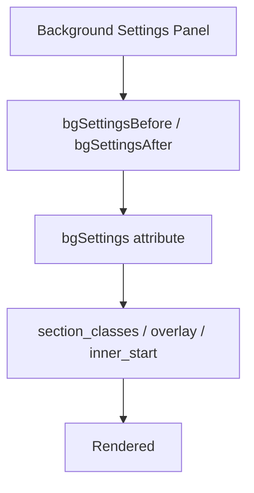

# Extend `l-section` background

Use this guide when you need to add settings to the background area of
`webentor/l-section` — an overlay, a background variant, or any project-specific
control — and want them to behave consistently in Gutenberg and on the frontend.

The extension model mirrors [`e-button`](./extend-e-button.md): core exposes the
extension points, and the consumer theme provides the concrete controls and CSS.

## How to think about it

`l-section` background settings have two kinds of extension:

- **Overlay is built into core.** It is a first-class setting (toggle + opacity +
  color), so you usually only need to restyle it in CSS — not re-implement it.
- **Everything else is injected.** Extra controls go into the "Background Image
  Settings" panel through before/after extension hooks, store their data on a
  free-form `bgSettings` attribute, and reach the frontend through PHP filters
  that add classes or markup to the rendered `<section>`.

If you only add the editor control but never bridge it to the frontend filters,
the setting will look editable in Gutenberg but do nothing on the site.

## End-to-end flow



## Built-in overlay

Toggle **Overlay** in the panel to render a `.w-section-overlay` element, with a
`w-section--has-overlay` class added to the `<section>`. Opacity and color are
driven by the `--w-section-overlay-opacity` / `--w-section-overlay-color` CSS
custom properties, so a theme can restyle the overlay entirely in CSS without
touching the block:

```css
/* Replace the flat color with a gradient, for example. */
.w-section--has-overlay .w-section-overlay {
  background: linear-gradient(transparent, rgb(0 0 0 / 60%));
  opacity: 1;
}
```

The overlay attribute shape is `{ enabled: boolean, opacity: number /* 0–100 */, color: string }`,
stored under the block's `overlay` attribute.

## 1. Add custom controls to the panel

`l-section` exposes two extension hooks so you can inject controls before or
after the built-in background settings:

- `webentor.core.l-section.bgSettingsBefore`
- `webentor.core.l-section.bgSettingsAfter`

Both have the signature `(node, props)` and must return a React node. This is the
right extension point for project-specific controls without forking the block.

Store control state on the free-form `bgSettings` attribute so you do not have to
register your own block attributes:

```tsx
import { addFilter } from '@wordpress/hooks';
import { SelectControl } from '@wordpress/components';
import { __ } from '@wordpress/i18n';

addFilter(
  'webentor.core.l-section.bgSettingsAfter',
  'theme/l-section-bg-variant',
  (node, props) => {
    const bgSettings = props.attributes?.bgSettings ?? {};

    return (
      <>
        {node}
        <SelectControl
          label={__('Background variant', 'webentor')}
          value={bgSettings.variant ?? ''}
          options={[
            { label: __('Default', 'webentor'), value: '' },
            { label: __('Dark', 'webentor'), value: 'dark' },
          ]}
          onChange={(value) =>
            props.setAttributes?.({
              bgSettings: { ...bgSettings, variant: value },
            })
          }
        />
      </>
    );
  },
);
```

Always spread the incoming `node` so you compose with — rather than replace —
other extensions registered on the same hook.

## 2. Bridge the setting to the frontend

The frontend `<section>` is rendered from
`packages/webentor-core/resources/blocks/l-section/view.blade.php`. Three PHP
filters let your stored `bgSettings` affect the rendered markup. Each receives
`($value, $attributes, $block)`.

### `webentor/l-section/section_classes`

Append classes to the `<section>` — the usual way to turn a variant value into a
CSS hook:

```php
add_filter('webentor/l-section/section_classes', function ($classes, $attributes) {
    $variant = $attributes['bgSettings']['variant'] ?? '';

    return $variant ? trim($classes . " w-section--variant-{$variant}") : $classes;
}, 10, 2);
```

Then style `.w-section--variant-dark` in your theme CSS.

### `webentor/l-section/overlay`

Override the overlay markup entirely (for example to render a gradient element or
add data attributes) when the built-in overlay is enabled:

```php
add_filter('webentor/l-section/overlay', function ($markup, $attributes) {
    return '<div class="w-section-overlay w-section-overlay--brand"></div>';
}, 10, 2);
```

### `webentor/l-section/inner_start`

Inject arbitrary markup at the very start of the `<section>` (before the
background image), e.g. a decorative layer:

```php
add_filter('webentor/l-section/inner_start', function ($markup, $attributes) {
    return '<span class="w-section-noise" aria-hidden="true"></span>';
}, 10, 2);
```

## Rule of thumb

If the setting is:

- an overlay: it already exists — restyle `.w-section-overlay` in CSS
- a new admin control: use `webentor.core.l-section.bgSettingsBefore` / `bgSettingsAfter`
- stored data: keep it on the `bgSettings` attribute object
- a frontend class (e.g. a variant): map it via `webentor/l-section/section_classes`
- frontend markup: use `webentor/l-section/overlay` or `webentor/l-section/inner_start`

## Related docs

- [Extend Button](./extend-e-button.md)
- [Editor Components](./editor-components.md)
- [Responsive Settings](../concepts/responsive-settings.md)
- [PHP API](../reference/php-api.md)
